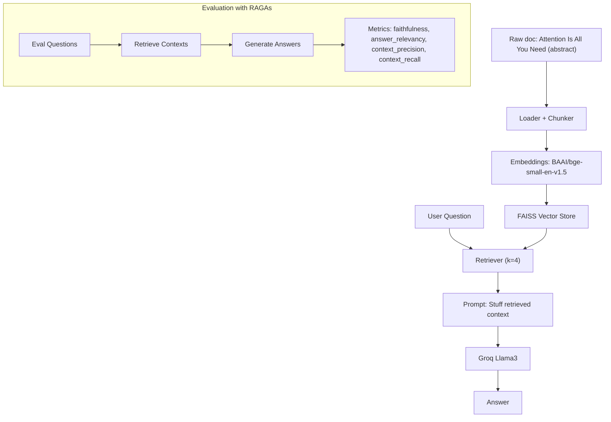

# rag-lab-with-evals

A compact lab to build and evaluate a Retrieval-Augmented Generation (RAG) system with an automated, reproducible evaluation pipeline.

**Key components:**
- LangChain for RAG orchestration
- FAISS (CPU) for vector search
- bge-small-en-v1.5 embeddings via sentence-transformers
- Groq Llama 3 as the LLM
- RAGAs for evaluation (faithfulness, answer relevancy, context precision, context recall)

---

## Architecture



---

## What gets evaluated

- **Faithfulness:** Does the answer stay grounded in the retrieved context?
- **Answer Relevancy:** Does the answer address the question?
- **Context Precision:** Are retrieved chunks focused on the question (low noise)?
- **Context Recall:** Do retrieved chunks cover the information needed?

---

## Quickstart

1. **Clone and install**
   - Requires Python 3.10+
   - From the project root:
     ```bash
     python -m venv .venv
     source .venv/bin/activate  # Windows: .venv\Scripts\activate
     pip install -r requirements.txt
     ```

2. **Get a free Groq API key**
   - Sign up at Groq Cloud and generate an API key.
   - Export it in your shell:
     ```bash
     export GROQ_API_KEY=your_groq_api_key
     ```

3. **Run the notebook**
   - Launch Jupyter and open `notebooks/01_rag_pipeline_and_evaluation.ipynb`:
     ```bash
     jupyter notebook
     ```
   - Run all cells to:
     - Build the RAG pipeline using the abstract of "Attention Is All You Need"
     - Create a small evaluation set
     - Generate answers
     - Score with RAGAs on four metrics

---

## Sample output

```text
RAGAs metrics (mean over eval set):
- faithfulness:      0.88
- answer_relevancy:  0.92
- context_precision: 0.79
- context_recall:    0.84
```

---

## Repository layout

- `data/raw/attention_is_all_you_need.txt` — source abstract
- `src/pipeline.py` — reusable functions to build the RAG pipeline
- `notebooks/01_rag_pipeline_and_evaluation.ipynb` — end-to-end build + evaluation
- `requirements.txt` — pinned dependencies
- `README.md` — project documentation

---

## Notes

- RAGAs uses an LLM to compute some metrics; the notebook configures RAGAs to use your Groq LLM and the same embedding model.
- If you encounter version conflicts, consider relaxing the pinned versions in `requirements.txt` slightly.
